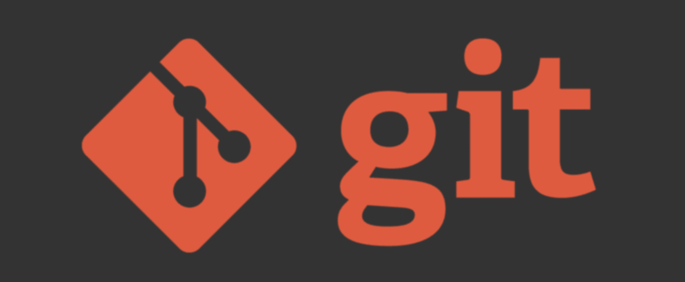

# Шпаргалка по GIT

# Git — система контроля версий (файлов).

## **Содержание**
+ [Базовая работа с GIT](#Base);
    + [Создание файла](#create);
    + [Изменение файла](#update);
    + [Команды](#baseCommands);
+ [Коммиты](#commits);
+ [Отмена коммитов](#cancelCommits);
    + [git reset](#gitReset);
    + [git reset по-умолчанию](#gitResetDefault);
    + [git reset --hard](#hard);
    + [git reset --mixed](#mixed);
    + [git reset --soft](#soft);
+ [Перемещение по коммитам](#checkout);
+ [Ветвление (Branching)](#branch);
    + [Переключение между ветками](#checkoutBranch);
    + [Слияние веток](#merge);
+ [Конфликты слияния](#mergeConflict);
+ ["Перенос" ветки](#rebase);
    + [Конфликты слияния при rebase](#rebaseConflict);
+ [Интерактивный rebase](#iRebase);
+ [Копирование коммита (перенос коммитов)](#cherry-pick);
+ [Работа с удаленным репозиторием](#remote);
    + [Команды](#remoteCommand);
    + [Удаленные ветки](#remoteBranch);
    + [git pull origin master](#pull);
+ [Vim (некоторые команды)](#vim);


## **Базовая работа с GIT**

 

### <a id="create"></a> **Создание файла**


| Вы создали файл | Статус “untracked” |
| --- | --- |
| git add | Статус “staged” (подготовленный) |
| git commit | Статус “committed” (зафиксированный) |

### <a id="update"></a> **Изменение файла**


| Вы изменили файл | Статус “modified” |
| --- | --- |
| git add | Статус “staged” (подготовленный) |
| git commit | Статус “committed” (зафиксированный) |

### <a id="baseCommands"></a> **Команды**


```
git status                          # узнать текущий статус репозитория
git add                             # подготовить файл(-ы) к commit’у
git commit -m “Название коммита”    # сделать commit
git log                             # показать историю коммитов
```


```
git diff              # показывает разницу между текущим неотслеживаемым состоянием репозитория и последним коммитом репозитория
git diff -staged      # показывает разницу между текущим отслеживаемым состоянием репозитория и последним коммитом репозитория
git diff COMMIT_ID    # показывает разницу между текущим состоянием репозитория и указанным коммитом репозитория
```

## <a id="commits"></a> **Коммиты**


```
git commit -m "Сообщение коммита"    # зафиксировать в коммите отслеживаемые изменения (закоммитить), добавить сообщение
git commit -a -m "Сообщение коммита" # то же самое, что последовательное выполнение git add . и git commit -m "Сообщение коммита"
git commit --amend -m "Новое сообщение коммита" # дополняет последний коммит, добавляя в него "свежие" изменения. Также, меняет сообщение последнего коммита. Новый коммит не создается!
```

!!! **git commit -a -m** не добавляет в отслеживаемую зону (и в коммит, соответственно) новые (untracked) файлы. Добавляет только модифицированные (modified) файлы.

## <a id="cancelCommits"></a> **Отмена коммитов**


### <a id="gitReset"></a> **git reset**


! Опасная команда, может быть использована для переписывания истории

Предназначена для отмены каких - либо изменений в проекте, откату проекта к какому - то коммиту.

Имеет 3 режима (в зависимости от радикальности отката к указанному коммиту):

- --soft
- --mixed
- --hard

### <a id="gitResetDefault"></a> **git reset по-умолчанию**


- При вызове без указания параметра [--soft | --mixed | --hard] по-умолчанию используется --mixed.

```
git reset HEAD^^ = git reset --mixed HEAD^^
```

- При вызове без указания желаемого коммита по-умолчанию используется HEAD.

```
git reset = git reset --mixed HEAD
```


### <a id="hard"></a> **git reset --hard**


Возвращает проект к указанному коммиту, при этом полностью удаляет все коммиты после указанного.

Самая "сильная" вариация git reset. Удаляет коммиты безвозвратно!

```
git reset --hard HEAD^^
```


### <a id="mixed"></a> **git reset --mixed**


Возвращает проект к указанному коммиту, при этом переводит все коммиты после указанного в неотслеживаемую (unstaged) зону.

```
git reset --mixed HEAD^^
```


### <a id="soft"></a> **git reset --soft**


Возвращает проект к указанному коммиту, при этом переводит все коммиты после указанного в отслеживаемую (staged) зону.

```
git reset --soft HEAD^^
```


## <a id="checkout"></a> **Перемещение между коммитами**


### **git checkout**


Используется для перемещения между коммитами, версиями отдельных файлов и ветками

```
git checkout <хэш commit #2>
git checkout HEAD^^
git checkout HEAD~2
```


Состояние проекта полностью вернулось к указанному снимку. При этом никакие коммиты не удалились. Мы в любой момент можем перенестись обратно в актуальную версию.

Указатель HEAD находится в состоянии DETACHED (рус. отделенный). Он отделен от актуальной версии проекта. Любые изменения или коммиты сделанные в этом состоянии удаляются сборщиком мусора при переходе к другому коммиту.

```
git checkout master     # переход обратно к актуальному коммиту
```


```
git checkout a0e33627548578d5b94c3b8f4f885303a2cd4eec -- file1 file2
```

```
git checkout -- file1
```

```
git checkout -- .
```

### **Если нужно удалить отслеживаемые измененения**


```
1. git reset           # переводит все отслеживаемые изменения в неотслеживаемые
2. git checkout -- .   # удаляет все неотслеживаемые изменения
```

## <a id="branch"></a> Ветвление (Branching)


**Зачем использовать ветвление?**

- Новые функции разрабатываются в отдельных ветках
- Ветка master содержит стабильную версию проекта. Можем вернуться на master в любой момент.
- Сразу несколько разработчиков могут работать в своих ветках над своими задачами. После завершения работы над задачами, эти ветки "сливаются" в master ветку.

```
git branch some-feature       # создать новую ветку с указанным именем на текущем коммите
git branch                    # показать список веток
git branch -v                 # показать список веток и последний коммит в каждой
git branch -d some-feature    # удалить ветку some-feature
git branch new_branch 5589877 # создать новую ветку с указанным именем на указанном коммите
git branch -f master 5589877  # переместить ветку master на указанный коммит
git branch -f master master~2 # переместить ветку master на 2 коммита назад
git branch --merged           # показать ветки, уже слитые с активной
git branch --no-merged        # показать ветки, не слитые с активной
git branch -a                 # показать все имеющиеся ветки (в т.ч. на удаленных репозиториях)
git branch -m old_branch_id new_branch_id # переименовать локально ветку old_branch_name в new_branch_name
git branch -m new_branch_name # переименовать локально ТЕКУЩУЮ ветку в new_branch_name
git push origin :old_branch_name new_branch_name # применить переименование в удаленном репозитории
git branch --unset-upstream   # завершить процесс переименования
```

### <a id="checkoutBranch"></a> Переключение между ветками


```
git checkout some-feature      # перейти в указанную ветку
git checkout -b some-feature   # создать новую ветку с указанным именем и перейти в неё
git checkout -B master 5589877 # переместить ветку с указанным именем на указанный коммит и перейти в неё
```

### <a id="merge"></a> Слияние веток


```
git merge add-feature1           # влить в ветку, в которой находимся, данные из ветки add-feature1
git merge add-feature1 -m "Горячая правка" # влить в ветку, в которой находимся, данные из ветки add-feature1 (указано сообщение коммита слияния)
git merge add-feature1 --log     # влить в ветку, в которой находимся, данные из ветки add-feature1, показать редактор описания коммита, добавить в него сообщения вливаемых коммитов
git merge add-feature1 --no-ff   # влить в ветку, в которой находимся, данные из ветки add-feature1, запретить простой сдвиг указателя, изменения из add-feature1 «останутся» в ней, а в активной ветке появится только коммит слияния
```

### Fast - Forward merge


- Пока мы работали в своей ветке, в ветке master ничего не произошло (не было новых коммитов)
- GIT'у очень легко слить ветку add-feature1 в master (не может возникнуть конфликтов)
- Не создается отдельный commit для слияния (merge commit)

### ~~Fast - Forward merge~~


- Пока вы работали в своей ветке, кто-то добавил коммиты в ветку master
- Могут возникнуть конфликты. Гит попробует решить их самостоятельно. Если у него не получится, придется решать их вручную.
- Cоздается merge commit .

## <a id="mergeConflict"></a> Конфликты слияния


- Изменили один и тот же файл
- Конфликт
- GIT не смог слить ветки
- Необходимо решить конфликт вручную


При возникновении конфликта, репозиторий находится в состоянии прерванного слияния. Нужно оставить в конфликтующих местах файлов только нужный код, проиндексировать изменения и закоммитить.

## <a id="rebase"></a> **«Перенос» ветки**


rebase - альтернатива merge

- Обе команды делают одно и то же - сливают ветки
- Команда merge может создавать merge commit при слиянии (в случае не fast-forward), команда rebase merge commit'а не создает
- Команда merge безопасней, чем rebase - есть отдельный commit, отображающий слияние
- Плюс merge - достоверная полная история commit'ов
- Плюс rebase - лаконичная линейная история без лишних коммитов


В ветку add-feature1 был добавлен Commit #4 из master. Затем, поверх него были добавлены коммиты из add-feature1. Теперь можно делать fast-forward слияние без merge commit'а

### <a id="rebaseConflict"></a> Конфликты слияния при rebase


Разрешение конфликта такое же, как в случае с merge.

```
git rebase --continue
git rebase --abort
```

## <a id="iRebase"></a> Интерактивный rebase

- Обычный rebase нужен для манипуляций с ветками, интерактивный rebase работает на одной ветке
- Обычный rebase берет коммиты из другой ветки, перемещает их в нашу ветку и поверх этих коммитов по одному применяет коммиты из временной зоны
- Интерактивный rebase не берет коммиты из другой ветки, он помещает некоторые коммиты из текущей ветки во временную зону и потом применяет эти коммиты опять к текущей ветке (в момент применения мы можем изменить коммиты)
- Несмотря на то, что название команд одинаковое, обычный rebase сильно отличается от интерактивного rebase (разная логика)

```
git rebase -i HEAD~3     # поменять три последних коммита
```

**Что можно делать с помощью интерактивного rebase?**

- Поменять коммиты местами
- Поменять название коммита / коммитов
- Объединить два коммита в один
- Добавить изменения в существующий коммит
- Разделить коммит на несколько коммитов

## <a id="cherry-pick"></a> **Копирование коммита (перенос коммитов)**


```
git cherry-pick     # используется тогда, когда нам надо "взять" один или несколько коммитов из другой ветки в нашу ветку
```


```
git checkout production        # убеждаемся, что мы в правильной ветке
git cherry-pick хэш_коммита    # переносим коммит 
```


```
git cherry-pick --edit   # перенести коммит из другой ветки, но при этом поменять сообщение коммита
```


```
git cherry-pick --no-commit     # перенести изменения из коммита из другой ветки, но при этом не делать коммит в нашей ветке. Изменения просто попадут в отслеживаемую зону.
```

### Другие параметры

```
git cherry-pick 5589877               # скопировать на активную ветку изменения из указанного коммита, закоммитить эти изменения
git cherry-pick master~2..master      # скопировать на активную ветку изменения из master (2 последних коммита)
git cherry-pick -n 5589877            # скопировать на активную ветку изменения из указанного коммита, но НЕ КОММИТИТЬ (подразумевается, что мы сами потом закоммитим)
git cherry-pick master..feature       # скопировать на активную ветку изменения из всех коммитов ветки feature с момента её расхождения с master (похоже на слияние веток, но это копирование изменений, а не слияние), закоммитить эти изменения; это может вызвать конфликт
git cherry-pick --abort               # прервать конфликтный перенос коммитов
git cherry-pick --continue            # продолжить конфликтный перенос коммитов (сработает только после решения конфликта)
git cherry-pick -x                    # указывает в сообщении коммита хэш того коммита, из которого мы сделали cherry-pick
git cherry-pick --signoff хэш_коммита # Указывает в сообщении коммита имя того пользователя, кто совершил cherry-pick
```

## <a id="remote"></a> Работа с удаленным репозиторием


```
git remote -v     # показать список удалённых репозиториев, связанных с локальным
```

**git remote add** НАЗВАНИЕ_РЕПОЗИТОРИЯ АДРЕС_РЕПОЗИТОРИЯ - добавить новый удаленный репозиторий, который находится по указанному адресу. При этом, на нашем компьютере к удаленному репозиторию мы будем обращаться по его названию

**git remote remove** НАЗВАНИЕ_РЕПОЗИТОРИЯ - удалить репозиторий с указанным названием

**git push** НАЗВАНИЕ_УДАЛЕННОГО_РЕПОЗИТОРИЯ ВЕТКА - команда для отправки локального репозитория на удаленный

### <a id="remoteCommand"></a> Команды


```
git remote remove origin   # убрать привязку удалённого репозитория с сокр. именем origin
git remote add origin https://github.com:nicothin/test.git # добавить удалённый репозиторий (с сокр. именем origin) с указанным URL
git remote rm origin       # удалить привязку удалённого репозитория
git remote show origin     # получить данные об удалённом репозитории с сокращенным именем origin
git checkout --track origin/github_branch # создать локальную ветку github_branch (данные взять из удалённого репозитория с сокр. именем origin, ветка github_branch) и переключиться на неё
git push origin master     # отправить в удалённый репозиторий (с сокр. именем origin) данные своей ветки master
```

### <a id="remoteBranch"></a> Удаленные ветки


```
git branch -r              # показать удаленные ветки
git branch -a              # показать все ветки(локальные и удаленные)  
```


- Локальные ветки - изменяются только вами
- Удаленные ветки - изменяются другими людьми

### <a id="pull"></a> git pull origin master


**git pull**  - "скачивает" новые коммиты с удаленного репозитория


- Скачивает (**1**) удаленную ветку с удаленного репозитория (обновляет ветку origin/master)
- Сливает (**2**) удаленную ветку с локальной веткой (производит актуализацию вашей локальной ветки)
- То же самое для любой другой ветки (git pull origin название_ветки)


```
git fetch origin           # скачать все ветки с удаленного репозитория (с сокр. именем origin), но не сливать со своими ветками
git fetch origin master    # то же, но скачивается только указанная ветка
```

- Команда git fetch "скачивает" удаленные ветки с репозитория, но не производит актуализацию ваших локальных веток (не делает слияния удаленной ветки с локальной)
- Как и обычно, слияние может быть fast-forward или не fast-forward

## <a id="vim"></a> **Vim (некоторые команды)**

```
# Нажатия кнопок
ESC     — переход в командный режим
i       — переход в режим редактирования текста
ZQ (зажат Shift, поочередное нажатие) — выход без сохранения
ZZ (зажат Shift, поочередное нажатие) — сохранить и выйти
```bash
# Нажатия кнопок
ESC     — переход в командный режим
i       — переход в режим редактирования текста
ZQ (зажат Shift, поочередное нажатие) — выход без сохранения
ZZ (зажат Shift, поочередное нажатие) — сохранить и выйти

# Ввод в командном режиме
:q!             — выйти без сохранения
:wq             — сохранить файл и выйти
:w filename.txt — сохранить файл как filename.txt
```